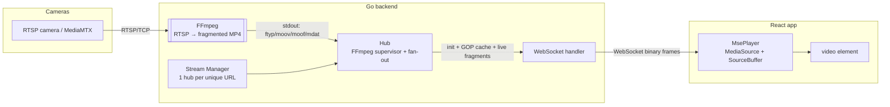

# RTSP Stream Viewer

Paste RTSP camera URLs into a web page and watch them live, one stream or a whole grid.

**Stack:** React + TypeScript (Vite) frontend, Go backend, FFmpeg, WebSockets, Media Source Extensions.

> **Live demo:** `https://<your-render-service>.onrender.com`. The demo ships with built-in test streams, so click **Try a demo stream → Add all** to see it working. On the free tier the server sleeps when idle and the first load can take ~30–60s; the UI says so while it waits.

---

## Features

- **Add streams by URL.** Validated on the client and on the server. Passwords are hidden in the UI and never written to server logs.
- **Grid of live streams** with Auto / 1 / 2 / 3 / 4 column layouts. It's responsive and drops to one column on phones.
- **Per-stream controls:** play/pause, reconnect, fullscreen (or double-click the video), rename (double-click the title), reorder, and remove.
- **Global controls:** pause all / play all. Streams also pause on their own while the browser tab is hidden, which saves bandwidth and CPU.
- **Live status on each tile:** connecting, live, reconnecting or error, plus resolution, codec, buffer delay and bitrate.
- **Clear error messages from FFmpeg failures**, for example *"Authentication failed — check the username/password"*, *"Stream not found (404)"*, *"Connection refused"* or *"Host not found"*. Both the server and the browser retry on their own with exponential backoff.
- **Low latency:** usually about 0.5–1.5s from camera to screen.
- **Efficient:** H.264 cameras are passed through without re-encoding. H.265 and other codecs are transcoded to H.264 automatically.
- **Shared upstream:** many viewers of the same camera share a single RTSP connection and a single FFmpeg process.
- Your stream list and layout are saved in `localStorage`, so they survive page reloads.

---

## Architecture



**How a stream flows**

1. The browser opens `GET /ws` and sends `{"type":"subscribe","url":"rtsp://…"}`. The URL goes in a message, not in the query string, so camera credentials never show up in access logs.
2. The **Manager** validates the URL and hashes it into a stream ID. If a **Hub** for that ID already exists, the viewer joins it. Otherwise a new Hub starts FFmpeg.
3. FFmpeg pulls RTSP over TCP and writes **fragmented MP4** to stdout:
   `-c:v copy -f mp4 -movflags empty_moov+default_base_moof+frag_keyframe -frag_duration 500000`
4. A small ISO-BMFF parser (`backend/internal/fmp4`) splits that output into the **init segment** (`ftyp+moov`) and **media segments** (`moof+mdat`). It also reads the exact codec string, such as `avc1.64001f`, and spots fragments that start with a keyframe.
5. The Hub caches the init segment and the **current GOP** (everything since the last keyframe). A new viewer gets *init + cached GOP* straight away, so video appears almost instantly instead of after the next keyframe.
6. In the browser, `MsePlayer` creates a `MediaSource` with that codec and appends the segments. It stays near the live edge by playing at 1.1× when it falls slightly behind and jumping ahead when it falls far behind. It also trims old buffer and recovers from gaps and stalls.

### Why fMP4 over WebSockets with MSE, rather than JSMpeg, HLS or WebRTC?

| Option | Why it wasn't picked |
| --- | --- |
| JSMpeg (MPEG-1 over WS) | Has to re-encode every stream, which is very CPU-heavy. The quality is poor and the software decoding drains client batteries. |
| HLS / LL-HLS | 2–6s latency, and it's HTTP polling rather than WebSockets. |
| WebRTC | The lowest latency, but it needs STUN/TURN and signaling, which is more than this project calls for. |
| **fMP4 + MSE** ✅ | The video is copied as-is, with no transcoding. The browser decodes it in hardware, latency is under 1s, and it runs in every modern browser, including iOS 17.1+ through `ManagedMediaSource`. |

### Robustness

| Failure | Handling |
| --- | --- |
| Camera unreachable, 401, 404, DNS failure | FFmpeg's stderr is turned into a readable message and sent to the tile. The server retries with backoff (1s → 30s) as long as someone is watching. |
| Camera drops in the middle of a stream | FFmpeg exits or the stall watchdog fires (no data for 15s). The pipeline restarts and viewers get a new init segment, then rebuild their MediaSource. |
| Non-H.264 source (H.265 etc.) | The codec is detected from `moov` and the pipeline restarts once with `libx264` (`TRANSCODE=auto`). |
| Slow viewer | The Hub never blocks. If a viewer's queue is full, it skips ahead to the next keyframe, so one slow client can't stall the others. |
| Backend restart or network loss | The browser reconnects with jittered exponential backoff, up to 15s. |
| Browser can't decode the codec | A clear fatal error appears on the tile. |
| Nobody watching | FFmpeg keeps running for `IDLE_TIMEOUT` (15s) so quick pause/play is instant, then stops. |

### Scalability

- **Cost per stream:** with `-c:v copy` FFmpeg only remuxes. In a local load test, **8 × 720p streams with 24 WebSocket viewers used about 7% of one CPU core in total and about 28 MB RSS** for the Go server.
- **Fan-out:** the number of RTSP connections depends on the number of *unique cameras*, not the number of viewers. Each Hub broadcasts the same byte slices to every subscriber without copying them.
- **Guards:** `MAX_STREAMS` limits concurrent upstream pulls and `MAX_VIEWERS_PER_STREAM` limits viewers per stream. Each stream's GOP cache is capped at 8 MB.
- **Scaling out:** Hubs are stateless apart from the live pipeline. You can run several instances behind a load balancer that hashes on stream ID (or the URL), so all viewers of a camera land on the same instance. For very large audiences, put an SFU or CDN with LL-HLS in front, using the same FFmpeg ingest.

---

## Repository layout

```
backend/                 Go service
  cmd/server/            main: config, HTTP server, graceful shutdown
  internal/config/       env-based configuration
  internal/fmp4/         fragmented-MP4 box reader, codec + keyframe detection (+ tests)
  internal/stream/       Manager, Hub (FFmpeg supervisor + fan-out), FFmpeg args, errors (+ tests)
  internal/server/       REST endpoints, WebSocket handler, CORS, SPA static serving
  Dockerfile             backend-only image
frontend/                React + TypeScript (Vite)
  src/lib/MsePlayer.ts   WebSocket → MediaSource player (the core of the client)
  src/lib/rtsp.ts        URL validation/redaction helpers (+ tests)
  src/components/        AddStreamForm, StreamTile, icons
  src/hooks/             stream list persistence, backend health, page visibility
  vercel.json            Vercel config for a split deployment
test-streams/            MediaMTX config + script that publishes FFmpeg test patterns
deploy/                  entrypoint + MediaMTX config for the all-in-one image's demo streams
Dockerfile               all-in-one image: UI + API + demo streams
docker-compose.yml       full local stack: app + MediaMTX + 3 simulated cameras
render.yaml              Render Blueprint
```

---

## Running locally

### Option A: Docker Compose (everything, one command)

```bash
docker compose up --build
```

Open http://localhost:8080 and click the demo streams. The compose file runs MediaMTX plus three FFmpeg "cameras" (720p H.264, 480p H.264, and an H.265 one that shows off auto-transcoding). The same streams are available on your host at `rtsp://localhost:8554/cam1`, `cam2` and `cam3-hevc`, so you can compare them in VLC.

### Option B: Run each part natively (for development)

**Prerequisites:** Go ≥ 1.23, Node ≥ 20.19, FFmpeg ≥ 5 (`brew install ffmpeg` / `apt install ffmpeg`), and [MediaMTX](https://github.com/bluenviron/mediamtx/releases) (`brew install mediamtx`) or Docker for the test streams.

```bash
# 1. Test RTSP streams (MediaMTX + FFmpeg test patterns)
./test-streams/start-test-streams.sh          # rtsp://localhost:8554/cam1..cam3 (+ cam-hevc)

# 2. Backend (http://localhost:8080)
cd backend
DEMO_STREAMS="Cam 1|rtsp://localhost:8554/cam1,Cam 2|rtsp://localhost:8554/cam2,Cam 3|rtsp://localhost:8554/cam3" \
  go run ./cmd/server

# 3. Frontend (http://localhost:5173; API and WebSocket are proxied to :8080)
cd frontend
npm install
npm run dev
```

Publishing your own stream to MediaMTX:

```bash
ffmpeg -re -stream_loop -1 -i any-video.mp4 -c:v libx264 -preset veryfast -g 50 -an \
       -f rtsp -rtsp_transport tcp rtsp://localhost:8554/mystream
```

### Tests

```bash
cd backend && go test -race ./...     # fMP4 parser (uses ffmpeg), URL validation, error mapping
cd frontend && npm test               # URL helpers (vitest)
```

---

## Deployment

### Render (recommended: one service for UI + API + demo streams)

1. Push this repo to GitHub.
2. In Render: **New → Blueprint**, then pick the repo. `render.yaml` builds the root `Dockerfile` on the free plan, with the health check at `/healthz`.
3. Open the service URL. That's the live demo. The image includes MediaMTX publishing three looping test clips on `127.0.0.1:8554`, which show up as demo chips. Setting `DEMO_MODE=false` turns them off.

Railway and Fly.io work the same way: deploy the root `Dockerfile` (it reads `PORT`).

### Vercel frontend + Render backend (split)

1. Deploy the backend as above. Either the root `Dockerfile` or `backend/Dockerfile` works.
2. On Vercel, import the repo and set **Root Directory = `frontend`**. Vite is detected from `vercel.json`.
3. Add the env var `VITE_BACKEND_URL=https://<your-backend>.onrender.com` and deploy.
4. On the backend, set `ALLOWED_ORIGINS=https://<your-app>.vercel.app`. Wildcards like `https://*.vercel.app` are supported.

> Vercel serverless functions can't hold long-lived WebSocket connections or run FFmpeg, so the backend has to run on a container platform such as Render, Railway or Fly.

> **Note on public deployments:** a cloud server can only pull RTSP URLs it can reach over the internet. Cameras on your home LAN (`192.168.x.x`) won't work from Render unless they're exposed, for example through port-forwarding, a VPN or Tailscale. Run the app locally for LAN cameras. To stop a public instance from being used as an open relay, set `ALLOWED_RTSP_HOSTS`.

---

## Configuration (backend environment variables)

| Variable | Default | Description |
| --- | --- | --- |
| `PORT` / `ADDR` | `8080` / `:8080` | Listen port/address (`PORT` wins) |
| `STATIC_DIR` | – | Serve the built frontend from this directory (all-in-one mode) |
| `ALLOWED_ORIGINS` | `*` | Comma-separated origins for CORS and WebSocket (`https://*.vercel.app` allowed) |
| `ALLOWED_RTSP_HOSTS` | – (any) | Allow-list of RTSP hosts: exact names, `*.domain`, or CIDRs |
| `TRANSCODE` | `auto` | `auto` (copy H.264, transcode the rest), `always`, `never` |
| `TRANSCODE_MAX_HEIGHT` | `720` | Output height cap when transcoding |
| `MAX_STREAMS` | `16` | Max concurrent upstream RTSP pulls |
| `MAX_VIEWERS_PER_STREAM` | `50` | Max WebSocket viewers per stream |
| `IDLE_TIMEOUT` | `15s` | Keep FFmpeg running this long after the last viewer leaves |
| `RTSP_TIMEOUT` | `10s` | RTSP socket timeout |
| `STALL_TIMEOUT` | `15s` | Restart the pipeline if no data arrives for this long |
| `DEMO_STREAMS` | – | `Name\|rtsp://…,Name\|rtsp://…`, shown as one-click demo chips |
| `DEMO_MODE` | `true` (Docker image) | Start the built-in MediaMTX demo streams |
| `FFMPEG_PATH` | `ffmpeg` | FFmpeg binary |
| `LOG_LEVEL` | `info` | `debug` also logs FFmpeg stderr |

Frontend: `VITE_BACKEND_URL` (empty means same origin).

## API

| Method | Path | Description |
| --- | --- | --- |
| `GET` | `/ws` | WebSocket stream endpoint (protocol below) |
| `POST` | `/api/streams/validate` | `{"url": "rtsp://…"}` → `{"id", "url"}` or `400 {"error"}` |
| `GET` | `/api/streams` | Active upstream streams: state, viewers, codec, resolution, bytes, restarts |
| `GET` | `/api/config` | Demo streams and limits for the UI |
| `GET` | `/healthz` | Liveness, uptime and active stream count |

**WebSocket protocol**

```
client → {"type":"subscribe","url":"rtsp://…"}
server → {"type":"status","state":"connecting|live|reconnecting|error","message":"…","retryInMs":2000}
server → {"type":"init","codec":"avc1.64001f","width":1280,"height":720,"transcoded":false}
server → <binary init segment: ftyp+moov>
server → <binary media segment: moof+mdat> …   (every ~0.5s)
server → {"type":"error","message":"…"} + close    (fatal, e.g. invalid URL)
```

## Known limitations

- Audio is dropped. Many IP cameras send G.711/PCM audio that MSE can't play, and a grid of streams is muted anyway.
- Playback needs Media Source Extensions with H.264 support. That covers Chrome, Edge, Firefox, Safari 17.1+ and iOS 17.1+. Open-source Chromium builds without proprietary codecs can't play H.264.
- Transcoding (H.265 sources) costs real CPU. On tiny free-tier instances, prefer H.264 cameras or set `TRANSCODE=never`.
- The stream list is stored per browser in `localStorage`. There are no user accounts.
